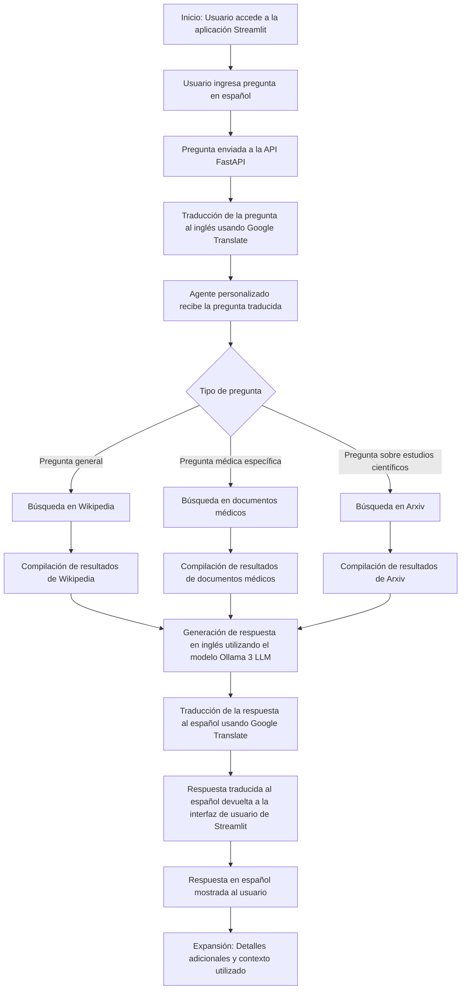

# Chatbot con FastAPI, Streamlit y LangChain

Este repositorio contiene un chatbot desarrollado utilizando FastAPI, Streamlit y LangChain, junto con los modelos de lenguaje Ollama 3 y un LLM genérico. El chatbot puede responder preguntas basadas en documentos proporcionados en formatos PDF, CSV y JSON, y utiliza herramientas adicionales como Wikipedia y Arxiv para proporcionar respuestas más completas.


## Requisitos previos
- Python 3.7 o superior
- Redis (opcional, para configuraciones avanzadas de caché)

## Instalación

Clonar el repositorio y navegar al directorio del proyecto:
```
git clone https://github.com/tu-usuario/nombre-del-repositorio.git
cd nombre-del-repositorio
```

Instalar las dependencias:
```
pip install -r requirements.txt
```

## Configuración

### Configurar las variables de entorno
Crear un archivo `.env` en el directorio raíz y añadir la clave API:
```
GROQ_API_KEY=TU_CLAVE_API_GROQ
```

### Caché
El sistema utiliza `aiocache` para caché en memoria, mejorando la eficiencia y la velocidad de respuesta del sistema. La configuración por defecto es suficiente para la mayoría de los casos, pero se puede configurar para usar Redis si se requiere persistencia y rendimiento mejorado.

## Uso de la API

Ejecutar la aplicación FastAPI:
```
uvicorn main:app --reload
```
La API estará disponible en `http://localhost:8000`.

Ejecutar la interfaz de usuario de Streamlit:
```
streamlit run streamlit_app.py
```

## Diagrama de Flujo del Proceso


## Contacto y Soporte
Si tienes alguna pregunta o encuentras algún problema, no dudes en abrir un issue en este repositorio.

¡Disfruta usando el chatbot!
