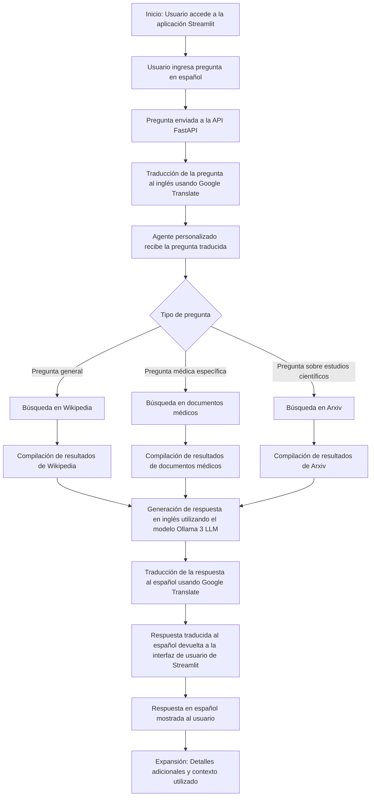

# Chatbot con FastAPI, Streamlit y LangChain

Este repositorio contiene un chatbot desarrollado utilizando FastAPI, Streamlit y LangChain, junto con los modelos de lenguaje Ollama 3 y un LLM genérico. El chatbot puede responder preguntas basadas en documentos proporcionados en formatos PDF, CSV y JSON, y utiliza herramientas adicionales como Wikipedia y Arxiv para proporcionar respuestas más completas.


## Requisitos previos
- Python 3.7 o superior
- Cuenta de Groq (si aplicable)

## Configuración

### Clonar el repositorio
```
git clone https://github.com/davidfdezmartin/Chatbot-con-FastAPI-Streamlit-y-LangChain.git
cd Chatbot-con-FastAPI-Streamlit-y-LangChain
```

### Crear y activar un entorno virtual
En Windows:
```
python -m venv venv
venv\Scripts\activate
```
En macOS y Linux:
```
python -m venv venv
source venv/bin/activate
```

### Instalar las dependencias
```
pip install -r requirements.txt
```

### Configurar las variables de entorno
Crear un archivo `.env` en el directorio raíz y añadir la clave API:
```
GROQ_API_KEY=TU_CLAVE_API_GROQ
```

## Uso de la API

### Ejecutar la aplicación FastAPI
```
uvicorn main:app --reload
```
La API estará disponible en `http://localhost:8000`.

### Ejecutar la aplicación Streamlit
```
streamlit run streamlit_app.py
```

## Diagrama de Flujo del Proceso


## Contacto y Soporte
Si tienes alguna pregunta o encuentras algún problema, no dudes en abrir un issue en este repositorio.

¡Disfruta usando el chatbot!
