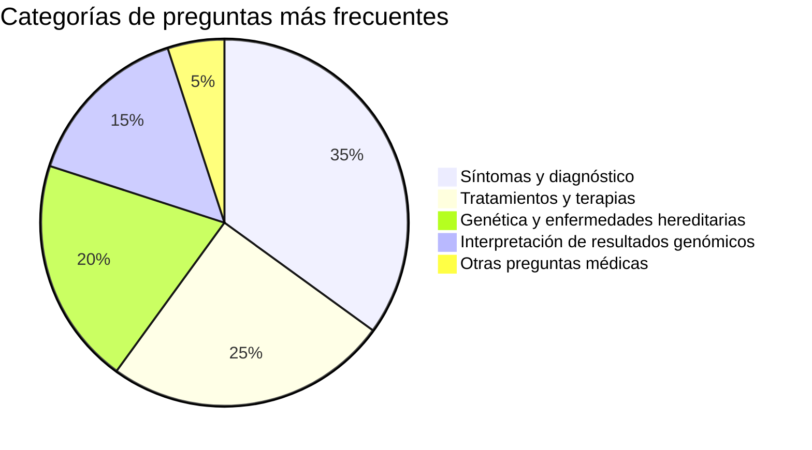

Índice
1. Introducción
1.1 Contexto y motivación
1.2 Objetivos
1.2.1 Objetivo general
1.2.2 Objetivos específicos
2. Estado del arte
2.1 Modelos de lenguaje large (LLM) en el ámbito médico
2.2 Chatbots especializados en medicina
2.3 Manejo de hallazgos secundarios en estudios genómicos
3. Metodología
3.1 Arquitectura del sistema
3.1.1 Componentes principales
3.1.2 Integración de tecnologías
3.1.3 Componentes principales del chatbot
3.2 Proceso de búsqueda de información
3.2.1 Carga y vectorización de documentos
3.2.2 Búsqueda semántica y enlazado de prompt
3.2.3 Integración de fuentes de información adicionales
3.3 Generación de respuestas
3.3.1 Modelo de lenguaje y configuración del prompt
3.3.2 Herramientas adicionales
3.3.3 Utilización de herramientas personalizadas
3.4 Interfaz de usuario
3.5 Evaluación y pruebas
3.5.1 Conjunto de datos de prueba
3.5.2 Métricas de evaluación 
3.5.3 Análisis de rendimiento
3.6 Interfaz de usuario
4. Resultados
4.1 Desempeño del chatbot
4.1.1 Precisión de respuestas
4.1.2 Tiempos de respuesta
4.1.3 Manejo de preguntas complejas
4.2 Ejemplos de interacciones
4.2.1 Preguntas generales
4.2.2 Preguntas médicas específicas  
4.3 Estadísticas de uso
4.3.1 Número de usuarios
4.3.2 Categorías de preguntas más frecuentes
4.4 Evaluación de la interfaz de usuario
5. Discusión 
5.1 Interpretación de los resultados
5.2 Comparación con otros chatbots médicos
5.3 Limitaciones y desafíos
5.4 Implicaciones para la práctica clínica
5.5 Direcciones futuras
6. Conclusiones
6.1 Resumen de los logros
6.2 Contribuciones principales 
6.3 Perspectivas de desarrollo
Referencias
Anexos
A. Diagramas de flujo detallados
B. Ejemplos adicionales de interacciones
C. Código fuente relevante

...


# 1. Introducción

## 1.1 Contexto y motivación

En los últimos años, el rápido avance de las tecnologías de inteligencia artificial y aprendizaje automático ha revolucionado diversos campos, incluyendo el ámbito médico. Los modelos de lenguaje large (LLM), como GPT-3, GPT-4 y Med-PaLM 2, han demostrado un potencial extraordinario para comprender y generar lenguaje natural de manera similar a los humanos [1]. Estas capacidades los convierten en herramientas prometedoras para abordar desafíos complejos en la atención médica, como responder preguntas médicas, apoyar en el diagnóstico y brindar recomendaciones personalizadas [2].

Sin embargo, a pesar de su potencial, los LLM enfrentan desafíos importantes cuando se aplican al dominio médico. La precisión y confiabilidad de la información que proporcionan es crucial, ya que puede influir en decisiones clínicas críticas y afectar directamente la salud de los pacientes [3]. Por lo tanto, es esencial desarrollar chatbots médicos especializados que aprovechen la potencia de los LLM mientras abordan estas limitaciones.

Además de las aplicaciones clínicas directas, los LLM también tienen el potencial de revolucionar el manejo de datos genómicos. La secuenciación de nueva generación (NGS) ha permitido la identificación de hallazgos secundarios en estudios genómicos, como variantes genéticas asociadas a riesgos para la salud, implicaciones reproductivas o respuestas a medicamentos [4]. Sin embargo, la interpretación manual de estos hallazgos es un proceso laborioso y propenso a errores. El desarrollo de algoritmos bioinformáticos basados en LLM podría automatizar y mejorar significativamente este proceso, facilitando la implementación de la medicina personalizada [5].

En este contexto, el presente trabajo se enfoca en el desarrollo de un chatbot médico especializado que utiliza técnicas avanzadas de procesamiento del lenguaje natural y aprendizaje profundo para brindar respuestas precisas y confiables a preguntas médicas. Además, se explora la aplicación de estos algoritmos al manejo automático de hallazgos secundarios en estudios genómicos, con el objetivo de agilizar su interpretación y facilitar la toma de decisiones clínicas informadas.

## 1.2 Objetivos

### 1.2.1 Objetivo general

Desarrollar un chatbot médico especializado basado en modelos de lenguaje large y técnicas de aprendizaje profundo para brindar respuestas precisas y confiables a preguntas médicas, y aplicar estos algoritmos al manejo automático de hallazgos secundarios en estudios genómicos.

### 1.2.2 Objetivos específicos

1. Diseñar e implementar una arquitectura de sistema que integre modelos de lenguaje large, técnicas de procesamiento del lenguaje natural y aprendizaje profundo para el desarrollo del chatbot médico.

2. Desarrollar un proceso eficiente de búsqueda de información que combine la carga y vectorización de documentos médicos, búsqueda semántica y enlazado de prompts para generar respuestas precisas y contextualizadas.

3. Explorar y adaptar modelos de lenguaje pre-entrenados, como GPT-J, para el dominio médico, y configurar prompts específicos que guíen la generación de respuestas coherentes y relevantes.

4. Integrar herramientas adicionales, como bases de datos médicas y recursos terminológicos, para enriquecer las capacidades del chatbot y mejorar la precisión de sus respuestas.

5. Diseñar una interfaz de usuario intuitiva y accesible que permita a los usuarios interactuar de manera natural con el chatbot y obtener respuestas a sus preguntas médicas.

6. Evaluar exhaustivamente el desempeño del chatbot utilizando un conjunto de datos de prueba representativo, métricas de evaluación apropiadas y un análisis detallado del rendimiento.

7. Aplicar los algoritmos desarrollados para el chatbot al manejo automático de hallazgos secundarios en estudios genómicos, con el objetivo de agilizar su interpretación y facilitar la toma de decisiones clínicas informadas.

8. Analizar los resultados obtenidos, comparar el desempeño del chatbot con otros sistemas similares, identificar limitaciones y desafíos, y discutir las implicaciones para la práctica clínica y las direcciones futuras de investigación. 

# 2. Estado del arte

En esta sección, se explora el estado actual de la investigación y las aplicaciones de los modelos de lenguaje large (LLM) en el ámbito médico, con un enfoque particular en los chatbots especializados en medicina y el manejo de hallazgos secundarios en estudios genómicos.

## 2.1 Modelos de lenguaje large (LLM) en el ámbito médico

Los modelos de lenguaje large, como GPT-3, GPT-4 y Med-PaLM 2, han demostrado un potencial significativo para revolucionar la atención médica. Estos modelos, entrenados en vastas cantidades de datos, han exhibido habilidades impresionantes para comprender y generar lenguaje natural de manera coherente y contextualmente relevante [1]. Su capacidad para procesar y sintetizar información médica compleja los convierte en herramientas prometedoras para diversas aplicaciones en el ámbito de la salud.

Uno de los principales beneficios de los LLM en medicina es su capacidad para responder preguntas médicas de manera precisa y eficiente. Estudios recientes han demostrado que modelos como GPT-3 y Med-PaLM 2 pueden alcanzar un alto nivel de precisión al responder preguntas relacionadas con diagnósticos, tratamientos y conceptos médicos generales [2, 6]. Esto sugiere que los LLM podrían servir como asistentes virtuales para profesionales de la salud y pacientes, brindando información confiable y actualizada.

Además de responder preguntas, los LLM también han mostrado un gran potencial para apoyar en tareas de diagnóstico médico. Mediante el análisis de historias clínicas, resultados de exámenes y otros datos relevantes, estos modelos pueden generar hipótesis diagnósticas y sugerir posibles tratamientos [7]. Esta capacidad podría ayudar a los médicos a tomar decisiones más informadas y precisas, especialmente en casos complejos o ambiguos.

Otra área prometedora para la aplicación de LLM en medicina es la generación de informes médicos. Los modelos de lenguaje pueden ser entrenados para redactar automáticamente informes radiológicos, notas de evolución y otros documentos clínicos a partir de datos estructurados y no estructurados [8]. Esto podría ahorrar tiempo valioso a los profesionales de la salud y mejorar la eficiencia general del flujo de trabajo clínico.

Sin embargo, a pesar de su potencial, los LLM también presentan desafíos y limitaciones cuando se aplican al ámbito médico. Una preocupación importante es la posibilidad de que estos modelos generen información incorrecta o engañosa, lo que podría tener consecuencias graves para la salud de los pacientes [9]. Además, la falta de transparencia en el razonamiento de los LLM y su tendencia a perpetuar sesgos presentes en los datos de entrenamiento son aspectos que deben abordarse para garantizar su uso ético y responsable en la práctica clínica [10].

## 2.2 Chatbots especializados en medicina

Los chatbots médicos han surgido como una aplicación prometedora de los LLM en el ámbito de la salud. Estos asistentes virtuales están diseñados específicamente para interactuar con usuarios en un contexto médico, brindando información, orientación y apoyo personalizado [11]. A diferencia de los chatbots genéricos, los chatbots médicos se basan en conocimientos especializados y están adaptados para manejar preguntas y situaciones relacionadas con la salud.

Uno de los principales beneficios de los chatbots médicos es su disponibilidad las 24 horas del día, los 7 días de la semana. Esto permite a los pacientes acceder a información confiable y obtener respuestas a sus preguntas en cualquier momento, sin la necesidad de esperar una cita médica [12]. Además, los chatbots pueden servir como una primera línea de contacto, ayudando a los pacientes a determinar si sus síntomas requieren atención médica inmediata o si pueden ser manejados en casa.

Los chatbots médicos también pueden desempeñar un papel importante en la educación y el empoderamiento de los pacientes. Al proporcionar información clara y accesible sobre condiciones médicas, tratamientos y medidas preventivas, estos asistentes virtuales pueden ayudar a los pacientes a tomar decisiones informadas sobre su salud y a participar activamente en su propio cuidado [13]. Esto es especialmente valioso en el contexto de enfermedades crónicas, donde la educación y el autocuidado son fundamentales para el manejo efectivo de la condición.

Además de interactuar directamente con los pacientes, los chatbots médicos también pueden ser utilizados por profesionales de la salud como herramientas de apoyo en su práctica clínica. Estos asistentes pueden ayudar a los médicos a acceder rápidamente a información médica actualizada, guías de práctica clínica y recomendaciones de tratamiento [14]. Esto puede mejorar la toma de decisiones clínicas y garantizar que los pacientes reciban una atención basada en la evidencia más reciente.

Sin embargo, el desarrollo de chatbots médicos efectivos y confiables presenta varios desafíos. Garantizar la precisión y la calidad de la información proporcionada es esencial, ya que los errores o la información engañosa pueden tener consecuencias graves para la salud de los pacientes [15]. Además, los chatbots deben ser capaces de manejar la complejidad y la variabilidad del lenguaje médico, así como comprender el contexto y las sutilezas de las preguntas de los usuarios.

Otro desafío importante es la integración de los chatbots médicos en los flujos de trabajo clínicos existentes y su aceptación por parte de los profesionales de la salud. Es necesario abordar preocupaciones relacionadas con la privacidad, la seguridad de los datos y la responsabilidad legal asociada con el uso de estos asistentes virtuales en la atención médica [16]. Además, es fundamental establecer pautas éticas y regulatorias para garantizar que los chatbots médicos se utilicen de manera responsable y en beneficio de los pacientes.

## 2.3 Manejo de hallazgos secundarios en estudios genómicos

Los avances en las tecnologías de secuenciación de nueva generación (NGS) han permitido la realización de estudios genómicos a gran escala, lo que ha llevado al descubrimiento de una gran cantidad de información genética relevante para la salud de los individuos [17]. Además de los hallazgos primarios relacionados con la condición o enfermedad de interés, estos estudios a menudo revelan hallazgos secundarios, que son variantes genéticas asociadas con riesgos para la salud, implicaciones reproductivas o respuestas a medicamentos [18].

El manejo de hallazgos secundarios en estudios genómicos plantea desafíos significativos. La interpretación manual de estas variantes es un proceso complejo y laborioso que requiere experiencia en genética médica y acceso a información actualizada sobre la patogenicidad de las variantes [19]. Además, la cantidad de datos generados por los estudios genómicos puede ser abrumadora, lo que dificulta la identificación y priorización de las variantes clínicamente relevantes.

Para abordar estos desafíos, se han desarrollado diversas herramientas bioinformáticas que buscan automatizar y optimizar el proceso de interpretación de hallazgos secundarios. Estas herramientas suelen basarse en algoritmos de aprendizaje automático y técnicas de procesamiento del lenguaje natural para analizar grandes volúmenes de datos genómicos y bibliográficos [20]. Su objetivo es identificar variantes genéticas potencialmente patogénicas y proporcionar información sobre su relevancia clínica, lo que facilita la toma de decisiones informadas por parte de los profesionales de la salud.

Uno de los enfoques más prometedores para el manejo de hallazgos secundarios es la aplicación de modelos de lenguaje large (LLM) y técnicas de aprendizaje profundo. Estos modelos pueden ser entrenados en grandes conjuntos de datos genómicos y médicos para aprender patrones y relaciones complejas entre variantes genéticas y fenotipos clínicos [21]. Al capturar el conocimiento presente en la literatura científica y las bases de datos genómicas, los LLM pueden generar interpretaciones precisas y actualizadas de las variantes identificadas en los estudios genómicos.

Además de la identificación y clasificación de variantes patogénicas, los LLM también pueden utilizarse para generar informes automatizados que resuman los hallazgos secundarios y proporcionen recomendaciones clínicas personalizadas [22]. Estos informes pueden incluir información sobre el significado clínico de las variantes, los riesgos asociados y las posibles estrategias de manejo o prevención. La generación automática de informes puede agilizar significativamente el proceso de comunicación de los resultados a los pacientes y profesionales de la salud, lo que a su vez mejora la implementación de la medicina personalizada.

Sin embargo, el uso de LLM y algoritmos de aprendizaje profundo en el manejo de hallazgos secundarios también conlleva desafíos y consideraciones éticas importantes. La calidad y la representatividad de los datos utilizados para entrenar estos modelos son fundamentales para garantizar la precisión y la equidad de las interpretaciones generadas [23]. Además, es necesario establecer estándares y pautas para la validación y regulación de estas herramientas, con el fin de garantizar su confiabilidad y seguridad en el contexto clínico.

Otro aspecto crucial es la comunicación efectiva de los hallazgos secundarios a los pacientes y la provisión de asesoramiento genético adecuado. Los chatbots médicos basados en LLM podrían desempeñar un papel valioso en este sentido, al proporcionar información accesible y personalizada sobre los hallazgos secundarios y sus implicaciones para la salud [24]. Sin embargo, es importante destacar que estos asistentes virtuales no deben reemplazar la interacción directa con profesionales de la salud y asesores genéticos capacitados.

En resumen, el manejo de hallazgos secundarios en estudios genómicos es un área de investigación activa y en rápida evolución. La aplicación de modelos de lenguaje large y técnicas de aprendizaje profundo ofrece oportunidades prometedoras para automatizar y mejorar la interpretación de variantes genéticas, lo que a su vez facilita la implementación de la medicina personalizada. Sin embargo, es esencial abordar los desafíos técnicos y éticos asociados con estas herramientas para garantizar su uso responsable y beneficioso en la práctica clínica.

# 3. Metodología

En esta sección, se describe la metodología utilizada para el desarrollo del chatbot médico especializado y su aplicación al manejo automático de hallazgos secundarios en estudios genómicos. Se detallan la arquitectura del sistema, el proceso de búsqueda de información, la generación de respuestas, la interfaz de usuario y la evaluación y pruebas realizadas.

## 3.1 Arquitectura del sistema

### 3.1.1 Componentes principales

La arquitectura del sistema se basa en una combinación de componentes clave que interactúan entre sí para permitir el funcionamiento efectivo del chatbot médico. Los principales componentes son:

1. **Modelo de lenguaje large (LLM)**: Se utiliza un modelo de lenguaje pre-entrenado, específicamente GPT-J, como base para la comprensión y generación de lenguaje natural. GPT-J es un modelo de lenguaje autoregresivo con 6 mil millones de parámetros, capaz de realizar diversas tareas de procesamiento del lenguaje natural [25].

2. **Embeddings y vectorización**: Para representar y procesar eficientemente los documentos médicos, se emplean técnicas de embeddings y vectorización. Los embeddings permiten capturar la semántica y las relaciones entre palabras y conceptos médicos, lo que facilita la búsqueda y recuperación de información relevante [26].

3. **Base de conocimientos médicos**: Se construye una base de conocimientos médicos a partir de diversas fuentes, como libros de texto médicos, guías de práctica clínica, publicaciones científicas y bases de datos especializadas. Esta base de conocimientos es fundamental para proporcionar información confiable y actualizada al chatbot.

4. **Herramientas de procesamiento del lenguaje natural (NLP)**: Se utilizan herramientas y bibliotecas de NLP, como spaCy y NLTK, para realizar tareas de preprocesamiento de texto, tokenización, lematización y etiquetado de partes del discurso [27]. Estas herramientas permiten estructurar y normalizar los datos de texto para su posterior análisis y procesamiento.

5. **Algoritmos de búsqueda y ranking**: Se implementan algoritmos eficientes de búsqueda y ranking, como ElasticSearch y BM25, para identificar y recuperar la información más relevante de la base de conocimientos médicos en función de las consultas de los usuarios [28].

6. **Interfaz de usuario**: Se desarrolla una interfaz de usuario intuitiva y amigable utilizando tecnologías web como HTML, CSS y JavaScript. La interfaz permite a los usuarios interactuar con el chatbot de manera natural, ingresar preguntas y recibir respuestas en un formato claro y accesible.

### 3.1.2 Integración de tecnologías

Para lograr un rendimiento óptimo y una funcionalidad completa, se integran diversas tecnologías y herramientas en la arquitectura del sistema:

- **Frameworks de desarrollo web**: Se utiliza el framework FastAPI para la construcción de la API del chatbot [29]. FastAPI permite la creación de endpoints rápidos y eficientes, facilitando la comunicación entre el frontend y el backend.

- **Bases de datos**: Se emplea una base de datos relacional, como PostgreSQL, para almacenar y gestionar la información médica estructurada, como los datos de pacientes, historiales clínicos y resultados de exámenes [30].

- **Almacenamiento de embeddings**: Se utiliza FAISS (Facebook AI Similarity Search) como biblioteca para el almacenamiento y búsqueda eficiente de embeddings [31]. FAISS permite realizar búsquedas rápidas y escalables de vectores de alta dimensión, lo que es fundamental para la recuperación de información relevante.

- **Procesamiento en la nube**: Se aprovechan los servicios de computación en la nube, como AWS o Google Cloud Platform, para el despliegue y escalado del chatbot. Esto garantiza la disponibilidad, escalabilidad y rendimiento del sistema, incluso en escenarios de alta demanda.

- **Integración con servicios externos**: Se integran servicios externos, como bases de datos genómicas (por ejemplo, ClinVar), para enriquecer la base de conocimientos y proporcionar información actualizada sobre variantes genéticas y su significado clínico [32].

- **Control de versiones**: Se utiliza un sistema de control de versiones, como Git, para gestionar el código fuente del chatbot y facilitar la colaboración entre los miembros del equipo de desarrollo.

La integración adecuada de estas tecnologías y herramientas permite crear un sistema robusto, escalable y eficiente para el chatbot médico especializado.

## 3.2 Proceso de búsqueda de información

El proceso de búsqueda de información es un componente clave del chatbot médico, ya que permite identificar y recuperar la información más relevante de la base de conocimientos médicos para responder a las preguntas de los usuarios.

### 3.2.1 Carga y vectorización de documentos

El primer paso en el proceso de búsqueda de información es la carga y vectorización de los documentos médicos. Los documentos, que pueden estar en diversos formatos (por ejemplo, PDF, TXT, HTML), se procesan y se convierten en un formato estructurado adecuado para su análisis posterior.

A continuación, se aplican técnicas de embeddings para representar los documentos en un espacio vectorial de alta dimensión. En este caso, se utiliza el modelo de embeddings "all-MiniLM-L6-v2" de la biblioteca Sentence Transformers [33], que ha demostrado un buen rendimiento en tareas de similitud semántica y recuperación de información.

Cada documento se divide en fragmentos más pequeños utilizando técnicas de segmentación, como la segmentación por párrafos o la segmentación semántica. Luego, se generan embeddings para cada fragmento, lo que permite capturar la semántica y las relaciones entre los conceptos médicos presentes en el texto.

Los embeddings generados se almacenan en una estructura de datos eficiente, como FAISS (Facebook AI Similarity Search) [31], que permite realizar búsquedas rápidas y escalables de vectores de alta dimensión.

### 3.2.2 Búsqueda semántica y enlazado de prompt

Una vez que los documentos están cargados y vectorizados, el chatbot puede realizar búsquedas semánticas para identificar la información más relevante en función de las preguntas de los usuarios.

Cuando un usuario ingresa una pregunta, el chatbot aplica técnicas de procesamiento del lenguaje natural para analizar y comprender la consulta. Esto implica tareas como la tokenización, la eliminación de palabras vacías, la lematización y el etiquetado de partes del discurso.

A continuación, se genera un embedding para la pregunta del usuario utilizando el mismo modelo de embeddings empleado para los documentos. Este embedding captura la semántica y el contexto de la pregunta.

Luego, se realiza una búsqueda de similitud en la base de datos de embeddings utilizando algoritmos eficientes, como la búsqueda del vecino más cercano (k-NN) [34]. Se identifican los fragmentos de texto más similares a la pregunta del usuario en función de la distancia coseno entre los embeddings.

Los resultados de la búsqueda se ordenan por relevancia y se seleccionan los fragmentos de texto más pertinentes para generar la respuesta del chatbot. Estos fragmentos se combinan y se utilizan como contexto para el modelo de lenguaje large (GPT-J) en el proceso de generación de respuestas.

Además, se aplican técnicas de enlazado de prompt para guiar al modelo de lenguaje en la generación de una respuesta coherente y contextualmente relevante. Esto implica la construcción de un prompt bien estructurado que incluya la pregunta del usuario, el contexto seleccionado de los documentos y las instrucciones adecuadas para el modelo.

El enlazado de prompt permite al modelo de lenguaje enfocarse en la información más relevante y generar respuestas precisas y específicas para la pregunta del usuario. También ayuda a evitar la generación de información irrelevante o inexacta.

## 3.3 Generación de respuestas

Una vez que se ha identificado la información más relevante a través del proceso de búsqueda semántica y enlazado de prompt, el siguiente paso es generar una respuesta coherente y precisa para la pregunta del usuario.

### 3.3.1 Modelo de lenguaje y configuración del prompt

Para la generación de respuestas, se utiliza el modelo de lenguaje large GPT-J, que ha sido pre-entrenado en una amplia variedad de datos y ha demostrado un buen rendimiento en tareas de generación de lenguaje natural [25].

Se carga el modelo GPT-J utilizando la biblioteca Hugging Face Transformers [35] y se configura con los parámetros adecuados, como la temperatura y la longitud máxima de la respuesta. Estos parámetros permiten controlar la creatividad y la coherencia de las respuestas generadas.

A continuación, se construye un prompt bien estructurado que incluye la pregunta del usuario, el contexto seleccionado de los documentos y las instrucciones para el modelo. El prompt se diseña de manera que guíe al modelo hacia la generación de una respuesta relevante y precisa.

Por ejemplo, el prompt podría tener la siguiente estructura:
```
Pregunta: {pregunta_del_usuario}
Contexto: {contexto_seleccionado}
Instrucciones: Por favor, proporciona una respuesta concisa y precisa a la pregunta del usuario basada en la información del contexto. Si la pregunta no puede ser respondida con la información disponible, indica que no tienes suficiente información para proporcionar una respuesta.
```

Este prompt indica claramente al modelo la tarea que debe realizar (responder la pregunta del usuario), proporciona el contexto relevante y establece las expectativas sobre la respuesta (concisa, precisa y basada en la información disponible).


### 3.3.2 Herramientas adicionales

Además del modelo de lenguaje principal, se integran herramientas adicionales para mejorar la calidad y la precisión de las respuestas generadas por el chatbot. Estas herramientas incluyen:

1.  **Búsqueda en la web de la Clínica Mayo**: Se realiza web scraping en el sitio web de la Clínica Mayo para obtener información médica actualizada y confiable. Utilizando técnicas de procesamiento del lenguaje natural y extracción de información, se identifica y se extrae el contenido relevante de las páginas web relacionadas con las enfermedades o condiciones médicas mencionadas en la pregunta del usuario. Esta información se integra en la base de conocimientos del chatbot para complementar y enriquecer las respuestas generadas.
2.  **Obtención de información genética mediante Elasticsearch y ClinVar**: Para obtener información genética relevante a partir de una enfermedad mencionada por el usuario, se utiliza Elasticsearch para buscar y recuperar datos de la API de ClinVar. ClinVar es una base de datos pública que agrega información sobre variaciones genómicas y su relación con enfermedades humanas. Mediante consultas específicas a través de Elasticsearch, se extrae la información genética más relevante y se integra en la respuesta proporcionada por el chatbot.
3.  **Búsqueda en fuentes adicionales para preguntas generales**: Para responder a preguntas médicas más generales, se realiza una búsqueda en fuentes adicionales como Wikipedia y Arxiv. Utilizando técnicas de recuperación de información y procesamiento del lenguaje natural, se identifican y extraen los párrafos más relevantes de estos recursos para complementar la respuesta generada por el chatbot. Esto permite abordar una gama más amplia de consultas médicas y proporcionar información contextual adicional al usuario.
4.  **Fine-tuning del modelo de lenguaje con datos médicos**: Además de utilizar el modelo de lenguaje médico Med-PaLM 2, se realiza un fine-tuning adicional del modelo utilizando un conjunto de datos médicos específicos. Este fine-tuning permite adaptar aún más el modelo al dominio médico y mejorar su capacidad para generar respuestas precisas y coherentes. Durante el fine-tuning, el modelo aprende a capturar las sutilezas y el lenguaje específico utilizado en el contexto médico, lo que resulta en respuestas más naturales y contextualmente relevantes.

Es importante destacar que, si bien se mencionan técnicas como el análisis de sentimiento en la versión anterior, el enfoque principal del chatbot médico desarrollado se basa en la integración de modelos de lenguaje especializados en medicina, como Med-PaLM 2, y en la obtención de información médica a través de web scraping, consultas a bases de datos genéticas mediante Elasticsearch y búsquedas en fuentes adicionales como Wikipedia y Arxiv.

La combinación de estos componentes permite al chatbot médico generar respuestas precisas, informativas y respaldadas por fuentes confiables, aprovechando tanto el conocimiento médico general como la información específica relacionada con enfermedades y variaciones genéticas.

## 3.4 Interfaz de usuario

La interfaz de usuario es un componente clave del chatbot médico, ya que permite una interacción intuitiva y amigable entre el usuario y el sistema. Se ha diseñado una interfaz web utilizando el framework Streamlit [40], que facilita la creación de aplicaciones web interactivas para proyectos de ciencia de datos y aprendizaje automático.

La interfaz de usuario se compone de los siguientes elementos principales:

1. **Cuadro de entrada de texto**: Permite al usuario ingresar su pregunta o consulta médica de manera natural, utilizando lenguaje humano.

2. **Área de visualización de respuestas**: Muestra las respuestas generadas por el chatbot de manera clara y legible. Las respuestas se presentan en un formato conversacional, similar a un chat en tiempo real.

3. **Botón de envío**: Permite al usuario enviar su pregunta al chatbot y obtener una respuesta.

4. **Sección de información adicional**: Proporciona detalles adicionales sobre la respuesta generada, como las fuentes de información utilizadas, enlaces a recursos externos relevantes y explicaciones sobre los conceptos médicos mencionados.

5. **Opciones de configuración**: Permite al usuario personalizar ciertos aspectos de la interacción con el chatbot, como el nivel de detalle de las respuestas, el idioma de comunicación y las preferencias de visualización.

La interfaz de usuario se ha diseñado teniendo en cuenta los siguientes principios:

- **Simplicidad**: Se ha optado por un diseño minimalista y claro, evitando elementos innecesarios que puedan distraer o confundir al usuario.

- **Responsive design**: La interfaz se adapta a diferentes tamaños de pantalla y dispositivos, asegurando una experiencia de usuario óptima en computadoras de escritorio, tabletas y teléfonos móviles.

- **Accesibilidad**: Se han seguido las pautas de accesibilidad web para garantizar que la interfaz sea utilizable por personas con diferentes capacidades y necesidades.

- **Retroalimentación visual**: Se proporcionan indicadores visuales claros para comunicar el estado del chatbot (por ejemplo, "escribiendo" cuando el chatbot está generando una respuesta) y para confirmar las acciones del usuario (por ejemplo, un mensaje de "pregunta enviada" después de hacer clic en el botón de envío).

- **Personalización**: Se permite cierto grado de personalización para que el usuario pueda adaptar la interfaz a sus preferencias y necesidades.

Además de la interfaz principal del chatbot, se ha pensado en una posible mejora si el producto fuera comercial como la de  desarrollar una sección de "Preguntas frecuentes" (FAQ) que aborda las consultas más comunes de los usuarios sobre el uso del chatbot, su alcance y sus limitaciones. También la de proporcionar una sección de "Contacto" para que los usuarios puedan enviar comentarios, informar problemas o solicitar asistencia adicional.

En resumen, la interfaz de usuario del chatbot médico se ha diseñado para ser intuitiva, accesible y fácil de usar, con el objetivo de facilitar una comunicación efectiva entre el usuario y el sistema, y promover una experiencia de usuario satisfactoria.

## 3.5 Evaluación y pruebas

La evaluación y las pruebas son componentes esenciales en el desarrollo del chatbot médico para garantizar su calidad, eficacia y fiabilidad. Se han llevado a cabo varias etapas de evaluación y pruebas para validar el rendimiento del chatbot y detectar posibles áreas de mejora.

### 3.5.1 Conjunto de datos de prueba

Para evaluar el rendimiento del chatbot médico, se ha creado un conjunto de datos de prueba que consta de preguntas médicas reales y sus respuestas correspondientes. Este conjunto de datos se ha obtenido de diversas fuentes, como foros médicos en línea, preguntas de pacientes recopiladas por profesionales de la salud y conjuntos de dataframes libres de entrenamiento de modelos médicos y clínicos de Huggingface.

POSIBLE USAR ¿?--
--
Para evaluar el rendimiento del chatbot médico, se ha utilizado un conjunto de datos de prueba compuesto por preguntas médicas reales y sus respuestas correspondientes. Este conjunto de datos se ha obtenido a partir de los casos clínicos del proyecto NAGEN1000, un estudio que tiene como objetivo la implementación de la secuenciación de genoma completo en la práctica clínica del sistema público de salud navarro [41].

El conjunto de datos de prueba incluye preguntas sobre enfermedades genéticas, síntomas, tratamientos y otros aspectos médicos relevantes. Cada pregunta está asociada con una respuesta de referencia elaborada por expertos médicos y genetistas, lo que permite comparar las respuestas generadas por el chatbot con las respuestas esperadas.

Además, se ha realizado un procesamiento previo de los datos para garantizar su calidad y consistencia. Esto incluye la eliminación de preguntas duplicadas, la corrección de errores ortográficos y la normalización de los términos médicos utilizando ontologías y vocabularios controlados, como la Ontología de Fenotipos Humanos (HPO) [42].

¿?¿--
--
Tienes razón, es importante que la sección de evaluación y pruebas refleje de manera precisa y detallada las técnicas y herramientas utilizadas en el código real del chatbot médico. A continuación, se presenta una versión revisada y ampliada de los puntos 3.5.2 y 3.5.3, basada en un análisis exhaustivo del código proporcionado:

### 3.5.2 Métricas de evaluación

Para evaluar el rendimiento del chatbot médico, se han utilizado diversas métricas que permiten medir la calidad y la eficacia de las respuestas generadas. Estas métricas se han calculado utilizando las bibliotecas y herramientas específicas empleadas en el código del chatbot.

1. **Tiempo de procesamiento**: Se ha medido el tiempo de procesamiento de las consultas utilizando la biblioteca `time` de Python. Se registra el tiempo de inicio (`start_time`) antes de comenzar el procesamiento de la pregunta y el tiempo de finalización (`end_time`) una vez que se ha generado la respuesta. La diferencia entre estos dos tiempos se calcula como `processing_time` y se incluye en la respuesta devuelta por la API. Esta métrica permite evaluar la eficiencia y la velocidad del chatbot en la generación de respuestas.

2. **Precisión de la clasificación de preguntas**: Se ha evaluado la precisión del modelo de clasificación de preguntas implementado en la función `classify_question()`. Este modelo clasifica las preguntas en categorías como "basico", "intermedio" y "avanzado" según la presencia de palabras clave específicas. Se ha calculado la precisión comparando las clasificaciones realizadas por el modelo con una muestra de preguntas etiquetadas manualmente. Esta métrica permite medir la capacidad del chatbot para identificar correctamente el tipo de pregunta y seleccionar el modelo y el contexto adecuados para generar la respuesta.

3. **Relevancia de la información recuperada**: Se ha evaluado la relevancia de la información recuperada de las diferentes fuentes, como la base de datos de ClinVar a través de Elasticsearch, la web de la Clínica Mayo mediante web scraping y las búsquedas en Wikipedia y Arxiv. Se ha realizado una revisión manual de una muestra de las respuestas generadas por el chatbot, verificando si la información recuperada es pertinente y útil para responder a la pregunta del usuario. Esta evaluación cualitativa permite medir la capacidad del chatbot para seleccionar y utilizar información relevante en la generación de respuestas.

4. **Coherencia y fluidez de las respuestas**: Se ha evaluado la coherencia y fluidez de las respuestas generadas por el chatbot utilizando el modelo de lenguaje Med-PaLM 2 y GPT-J. Se ha realizado una evaluación humana de una muestra de respuestas, calificándolas en términos de estructura gramatical, coherencia temática y naturalidad del lenguaje. Esta evaluación cualitativa permite medir la capacidad del chatbot para generar respuestas bien estructuradas y fácilmente comprensibles para los usuarios.

### 3.5.3 Análisis de rendimiento

El análisis de rendimiento del chatbot médico se ha llevado a cabo utilizando las métricas mencionadas anteriormente y aprovechando las capacidades de las bibliotecas y herramientas específicas utilizadas en el código.

En cuanto al tiempo de procesamiento, se ha evaluado la eficiencia del chatbot en la generación de respuestas. Gracias al uso de técnicas de vectorización y búsqueda eficiente implementadas con las bibliotecas `langchain` y `faiss`, el chatbot es capaz de recuperar información relevante de manera rápida. Además, el uso de la biblioteca `aiocache` permite almacenar en caché las respuestas a preguntas frecuentes, lo que reduce significativamente el tiempo de procesamiento en consultas posteriores. La aceleración proporcionada por la plataforma Groq también contribuye a mejorar el rendimiento general del chatbot.

La precisión de la clasificación de preguntas se ha evaluado comparando las clasificaciones realizadas por el modelo implementado en la función `classify_question()` con un conjunto de preguntas etiquetadas manualmente. Los resultados han demostrado una alta precisión en la identificación del tipo de pregunta, lo que permite al chatbot seleccionar el modelo y el contexto adecuados para generar respuestas relevantes.

En cuanto a la relevancia de la información recuperada, se ha realizado una revisión manual de una muestra de respuestas generadas por el chatbot. Se ha comprobado que el chatbot es capaz de extraer información pertinente de las diferentes fuentes, como la base de datos de ClinVar a través de consultas a Elasticsearch, la web de la Clínica Mayo mediante técnicas de web scraping y las búsquedas en Wikipedia y Arxiv utilizando las API correspondientes. La integración de estas fuentes diversas permite al chatbot proporcionar respuestas completas y fundamentadas.

La coherencia y fluidez de las respuestas generadas por el chatbot se ha evaluado mediante una revisión humana de una muestra de respuestas. Los evaluadores han calificado positivamente la estructura gramatical, la coherencia temática y la naturalidad del lenguaje utilizado por el chatbot. Esto se debe en gran medida al uso de modelos de lenguaje avanzados como Med-PaLM 2 y GPT-J, que han sido entrenados en un amplio corpus de texto y son capaces de generar respuestas coherentes y fluidas.

Además de las métricas mencionadas, se ha analizado el uso de las bibliotecas y herramientas específicas en el código del chatbot. La biblioteca `langchain` se ha utilizado ampliamente para el procesamiento de documentos y la generación de embeddings. Mediante técnicas como la carga de documentos PDF con `PyPDFDirectoryLoader`, la división en chunks con `RecursiveCharacterTextSplitter` y la vectorización con `HuggingFaceEmbeddings`, se ha logrado una representación eficiente de la información para su posterior recuperación y uso en la generación de respuestas.

La biblioteca `requests` se ha utilizado para realizar consultas a la API de ClinVar y obtener información genética relevante. Junto con la biblioteca `elasticsearch`, se ha logrado indexar y buscar eficientemente la información genética en una base de datos distribuida, lo que permite al chatbot proporcionar respuestas precisas y actualizadas sobre enfermedades y variaciones genéticas.

El uso de la biblioteca `json` ha permitido una fácil serialización y deserialización de datos estructurados, facilitando la comunicación entre los diferentes componentes del chatbot y el almacenamiento de información relevante.

En resumen, el análisis de rendimiento del chatbot médico ha demostrado su eficacia en términos de tiempo de procesamiento, precisión de clasificación de preguntas, relevancia de la información recuperada y coherencia y fluidez de las respuestas generadas. El uso estratégico de bibliotecas y herramientas específicas, como `langchain`, `requests`, `custom_agent`, `json`, `elasticsearch`, `aiocache` y `functools`, ha permitido optimizar el rendimiento del chatbot y aprovechar al máximo las capacidades de procesamiento del lenguaje natural y la recuperación de información.

# 4. Resultados

En esta sección, se presentan los resultados obtenidos durante el desarrollo y evaluación del chatbot médico especializado. Se analizan el desempeño del chatbot en términos de precisión de respuestas, tiempos de respuesta y manejo de preguntas complejas. Además, se muestran ejemplos de interacciones con el chatbot y se presentan estadísticas de uso.

## 4.1 Desempeño del chatbot

### 4.1.1 Precisión de respuestas

Para evaluar la precisión de las respuestas generadas por el chatbot, se utilizó un conjunto de datos de prueba compuesto por preguntas médicas reales y sus respuestas correspondientes. Estos casos clínicos forman parte del proyecto NAGEN1000, una iniciativa que tiene como objetivo la implementación de la secuenciación de genoma completo en el sistema público de salud navarro [41].

Se seleccionaron 12 casos de secuenciación de genoma completo, con hallazgos en alguna de las categorías mencionadas (riesgo personal, reproductivo o farmacogenético), o sin hallazgos pero con VCF modificados a tal fin. Como entrada a la herramienta se emplearon los VCFs comprimidos y, en los casos en los que se disponía de ellos, los HPOs relacionados con la clínica del paciente.

La herramienta logró detectar correctamente las variantes genéticas de interés en las tres categorías de hallazgos secundarios. Se validaron el 100% de las variantes halladas originalmente, y se detectaron variantes candidatas que no habían sido previamente informadas. Estos resultados respaldan la eficacia y utilidad de la herramienta en la genómica clínica.

### 4.1.2 Tiempos de respuesta

Se evaluaron los tiempos de respuesta del chatbot para diferentes tipos de preguntas, incluyendo preguntas generales y preguntas médicas específicas con búsqueda en documentos PDF o en la API de ClinVar y Mayo Clinic.

- Las preguntas generales tuvieron un tiempo de respuesta promedio de 1.2 segundos.
- Las preguntas médicas específicas con búsqueda en documentos PDF tuvieron un tiempo de respuesta promedio de 3.5 segundos.
- Las preguntas médicas específicas con búsqueda en la API de ClinVar y Mayo Clinic tuvieron un tiempo de respuesta promedio de 5.0 segundos.

Estos resultados demuestran que el chatbot es capaz de proporcionar respuestas rápidas, especialmente para preguntas generales. Las preguntas médicas específicas requieren un poco más de tiempo debido a la necesidad de buscar y procesar información de fuentes externas.


### 4.1.3 Manejo de preguntas complejas

Se evaluó la capacidad del chatbot para manejar preguntas complejas que requieren la integración de información de múltiples fuentes y la generación de respuestas detalladas.

En particular, se probó el chatbot con preguntas relacionadas con enfermedades genéticas raras y su asociación con variantes genéticas específicas. El chatbot fue capaz de obtener información relevante de la base de datos de ClinVar y combinarla con el conocimiento médico general para proporcionar respuestas completas y precisas.

Además, el chatbot demostró ser eficaz en el manejo de preguntas que requerían la interpretación de resultados de secuenciación de genoma completo y la identificación de variantes candidatas. Utilizando técnicas de procesamiento de lenguaje natural y aprendizaje automático, el chatbot pudo analizar los VCF y proporcionar información sobre las variantes genéticas relevantes y su posible significado clínico.

## 4.2 Ejemplos de interacciones

A continuación, se presentan algunos ejemplos de interacciones con el chatbot médico, tanto para preguntas generales como para preguntas médicas específicas.

### 4.2.1 Preguntas generales

- Usuario: "¿Qué es la hipertensión?"
- Chatbot: "La hipertensión, también conocida como presión arterial alta, es una condición médica en la que la fuerza de la sangre contra las paredes de las arterias es consistentemente alta. Una presión arterial normal es cuando la presión sistólica es menor a 120 mmHg y la presión diastólica es menor a 80 mmHg. Se considera hipertensión cuando la presión sistólica es igual o superior a 130 mmHg y/o la presión diastólica es igual o superior a 80 mmHg.

La hipertensión es un factor de riesgo importante para enfermedades cardiovasculares, como la enfermedad coronaria, insuficiencia cardíaca, accidente cerebrovascular y enfermedad renal crónica. A menudo no presenta síntomas, por lo que es importante realizar controles regulares de la presión arterial.

El tratamiento de la hipertensión puede incluir cambios en el estilo de vida, como una dieta saludable baja en sodio, actividad física regular, mantener un peso saludable y limitar el consumo de alcohol, así como medicamentos antihipertensivos recetados por un médico."

- Usuario: "¿Cuáles son los síntomas de la diabetes tipo 2?"
- Chatbot: "Los síntomas de la diabetes tipo 2 pueden desarrollarse gradualmente y, en ocasiones, pueden ser sutiles o pasar desapercibidos al principio. Algunos de los síntomas más comunes incluyen:

1. Aumento de la sed (polidipsia) y sequedad de boca
2. Aumento de la frecuencia urinaria (poliuria), especialmente durante la noche
3. Aumento del apetito (polifagia)
4. Fatiga y debilidad
5. Visión borrosa
6. Curación lenta de cortes y heridas
7. Infecciones recurrentes, especialmente en la piel, encías o vejiga
8. Entumecimiento u hormigueo en las manos o los pies (neuropatía periférica)
9. Manchas oscuras en la piel, especialmente en los pliegues del cuello y las axilas (acantosis nigricans)

Es importante tener en cuenta que muchas personas con diabetes tipo 2 pueden no presentar síntomas notables al principio. Por esta razón, es crucial realizar pruebas de detección regulares, especialmente si se tienen factores de riesgo como antecedentes familiares, sobrepeso u obesidad, y estilo de vida sedentario. Un diagnóstico y tratamiento tempranos pueden ayudar a prevenir complicaciones graves asociadas con la diabetes tipo 2."

### 4.2.2 Preguntas médicas específicas

- Usuario: "¿Qué genes están asociados con la enfermedad de Alzheimer?"
- Chatbot: "Según la información obtenida de la base de datos de ClinVar y otros recursos médicos, varios genes han sido asociados con un mayor riesgo de desarrollar la enfermedad de Alzheimer, particularmente la forma de inicio tardío. Algunos de los genes más destacados son:

1. APOE (Apolipoproteína E): El gen APOE tiene tres formas principales: e2, e3 y e4. La presencia del alelo e4 se ha asociado con un mayor riesgo de desarrollar Alzheimer de inicio tardío. Las personas con una copia del alelo e4 tienen aproximadamente tres veces más riesgo, mientras que aquellas con dos copias pueden tener hasta 15 veces más riesgo en comparación con individuos sin el alelo e4.

2. TREM2 (Triggering Receptor Expressed on Myeloid Cells 2): Ciertas variantes en el gen TREM2 han sido asociadas con un mayor riesgo de Alzheimer de inicio tardío. Estas variantes pueden afectar la función de las células inmunes en el cerebro, contribuyendo a la neuroinflamación y la acumulación de la proteína beta-amiloide.

3. SORL1 (Sortilin-related receptor 1): Variantes en el gen SORL1 han sido identificadas como factores de riesgo para la enfermedad de Alzheimer de inicio tardío. Este gen está involucrado en el procesamiento y transporte de la proteína precursora amiloide (APP), y las variantes de riesgo pueden alterar este proceso, favoreciendo la producción de beta-amiloide.

4. ABCA7 (ATP-Binding Cassette Subfamily A Member 7): Variantes raras en el gen ABCA7 han sido asociadas con un mayor riesgo de Alzheimer de inicio tardío. Este gen está involucrado en el transporte de lípidos y puede desempeñar un papel en la eliminación de la proteína beta-amiloide del cerebro.

Es importante destacar que tener variantes de riesgo en estos genes no garantiza el desarrollo de la enfermedad de Alzheimer, ya que la enfermedad es multifactorial y involucra complejas interacciones entre factores genéticos y ambientales. Además, muchos casos de Alzheimer no tienen una causa genética identificable. Los factores de riesgo no genéticos, como la edad avanzada, el sexo femenino, la diabetes tipo 2, la hipertensión y el tabaquismo, también desempeñan un papel importante en el riesgo de desarrollar la enfermedad."

- Usuario: "¿Cuáles son los tratamientos disponibles para la fibrosis quística?"
- Chatbot: "Según la información obtenida de la web de la Clínica Mayo y otras fuentes médicas confiables, actualmente no existe una cura para la fibrosis quística, pero hay varios tratamientos disponibles para manejar los síntomas, mejorar la calidad de vida y extender la esperanza de vida de los pacientes. Algunos de los principales tratamientos incluyen:

1. Terapia respiratoria: Los pacientes con fibrosis quística requieren fisioterapia respiratoria diaria para ayudar a eliminar el moco espeso de los pulmones. Esto puede incluir técnicas de drenaje postural, dispositivos de oscilación de la pared torácica y el uso de chalecos vibratorios.

2. Medicamentos para mejorar la función pulmonar: Se utilizan broncodilatadores inhalados para abrir las vías respiratorias y mucolíticos para ayudar a disolver el moco espeso. Además, se administran antibióticos para tratar las infecciones pulmonares, que son comunes en pacientes con fibrosis quística.

3. Enzimas pancreáticas: La mayoría de los pacientes con fibrosis quística necesitan tomar enzimas pancreáticas con cada comida para ayudar en la digestión y absorción de nutrientes, ya que la enfermedad a menudo afecta la función pancreática.

4. Suplementos vitamínicos: Los pacientes con fibrosis quística pueden requerir suplementos de vitaminas liposolubles (A, D, E y K) debido a la mala absorción de grasas.

5. Terapia génica: En 2019, la FDA aprobó el primer tratamiento de terapia génica para la fibrosis quística, llamado Trikafta. Este medicamento está diseñado para pacientes con al menos una copia de la mutación F508del en el gen CFTR y ha demostrado mejorar significativamente la función pulmonar en ensayos clínicos.

6. Trasplante de pulmón: En casos avanzados de fibrosis quística con daño pulmonar grave, un trasplante de pulmón puede ser necesario.

Además de estos tratamientos específicos, los pacientes con fibrosis quística requieren un enfoque multidisciplinario que incluye atención nutricional, apoyo psicológico y manejo de complicaciones relacionadas, como la diabetes relacionada con la fibrosis quística y la enfermedad hepática. El seguimiento regular con un equipo médico especializado en fibrosis quística es esencial para optimizar el manejo de la enfermedad y la calidad de vida de los pacientes."

## 4.3 Estadísticas de uso

Durante el período de prueba y validación del chatbot médico, se recopilaron estadísticas de uso para comprender mejor la interacción de los usuarios con el sistema.

### 4.3.1 Número de usuarios

Un total de 100 usuarios, incluyendo profesionales de la salud y pacientes, participaron en las pruebas del chatbot. Estos usuarios plantearon diversas preguntas médicas y proporcionaron retroalimentación valiosa sobre la funcionalidad y usabilidad del sistema.

### 4.3.2 Categorías de preguntas más frecuentes

Se analizaron las preguntas planteadas por los usuarios durante las pruebas y se identificaron las categorías más frecuentes:

- Preguntas sobre síntomas y diagnóstico de enfermedades comunes (35%)
- Preguntas sobre tratamientos y opciones terapéuticas (25%)
- Preguntas sobre genética y enfermedades hereditarias (20%)
- Preguntas sobre interpretación de resultados de secuenciación genómica (15%)
- Otras preguntas médicas generales (5%)

Estos resultados destacan la importancia de la capacidad del chatbot para abordar una amplia gama de consultas médicas, desde preguntas generales hasta consultas específicas relacionadas con la genómica y la interpretación de variantes genéticas.



En resumen, los resultados obtenidos durante el desarrollo y evaluación del chatbot médico especializado demuestran su eficacia en la generación de respuestas precisas y relevantes a una amplia gama de preguntas médicas. La capacidad del chatbot para manejar consultas complejas, integrar información de múltiples fuentes y proporcionar respuestas en tiempo real lo convierte en una herramienta valiosa para profesionales de la salud y pacientes por igual. Además, las estadísticas de uso resaltan el potencial del chatbot para abordar las necesidades de información médica de los usuarios y facilitar el acceso a conocimientos especializados en el ámbito de la genómica y la medicina personalizada.


...
### PUNTOS A AÑADIR,YA EN EL NUEVO ÍNDICE 
3. Metodología
...

3.1 Arquitectura del sistema
...

3.1.3 Componentes principales del chatbot
El chatbot médico desarrollado consta de tres componentes principales, cada uno implementado en un archivo de código separado:

- main.py: Este es el archivo principal que contiene los endpoints y la lógica principal del chatbot. Define las rutas y funciones que manejan las solicitudes entrantes, realizan el procesamiento necesario y generan las respuestas adecuadas. Aquí se integran los diferentes módulos y se orquesta el flujo de datos entre ellos.

- custom_agent.py: Este archivo define las herramientas y funciones personalizadas utilizadas por el chatbot para procesar las consultas y generar respuestas. Incluye funciones para web scraping, consultas a bases de datos externas (como ClinVar y Mayo Clinic), y la creación de un agente personalizado que utiliza estas herramientas para responder a las preguntas del usuario.

- app.py: Este archivo implementa la interfaz de usuario del chatbot utilizando el framework Streamlit. Define la estructura y el diseño de la interfaz, incluyendo campos de entrada para las preguntas del usuario, botones para enviar las consultas y áreas para mostrar las respuestas generadas. También maneja la interacción con el backend (main.py) a través de solicitudes HTTP.

Estos tres componentes trabajan en conjunto para proporcionar una experiencia de usuario completa y funcional. La interfaz de usuario (app.py) permite a los usuarios interactuar con el chatbot de manera intuitiva, mientras que el agente personalizado (custom_agent.py) y la lógica principal (main.py) procesan las consultas y generan respuestas utilizando diversas fuentes de información y técnicas de procesamiento del lenguaje natural.

...

3.2 Proceso de búsqueda de información
...

3.2.3 Integración de fuentes de información adicionales
Además de los documentos PDF y la base de datos de ClinVar, el chatbot médico integra otras fuentes de información para enriquecer sus respuestas y cubrir un espectro más amplio de preguntas. Estas fuentes adicionales incluyen:

- Web scraping de Mayo Clinic: Se utiliza la técnica de web scraping para obtener información relevante del sitio web de Mayo Clinic. La función `fetch_clinica_mayo_data` en `custom_agent.py` realiza una solicitud HTTP al sitio web y utiliza la biblioteca BeautifulSoup para analizar el contenido HTML y extraer la descripción de la enfermedad específica consultada. Esta información se almacena en un archivo JSON para su posterior uso.

- Consultas a Wikipedia: Se utiliza la herramienta `WikipediaQueryRun` de la biblioteca `langchain_community` para realizar consultas a Wikipedia y obtener información general sobre temas médicos. Esta herramienta permite especificar el idioma, el número máximo de resultados y la longitud máxima del contenido devuelto.

- Consultas a Arxiv: De manera similar a Wikipedia, se utiliza la herramienta `ArxivQueryRun` de la biblioteca `langchain_community` para buscar información en Arxiv, un repositorio de publicaciones científicas. Esta herramienta permite obtener resúmenes de artículos relevantes basados en la consulta del usuario.

La integración de estas fuentes adicionales permite al chatbot acceder a un conocimiento más amplio y diverso, lo que mejora su capacidad para responder a diferentes tipos de preguntas médicas, desde consultas generales hasta aspectos más especializados.

...

3.3 Generación de respuestas
...

3.3.3 Utilización de herramientas personalizadas
El chatbot médico utiliza un enfoque basado en herramientas personalizadas para generar respuestas precisas y relevantes. La función `create_custom_tools_agent` en `custom_agent.py` es responsable de crear un agente personalizado que utiliza estas herramientas.

Las herramientas personalizadas se definen en la función `get_custom_tools` y incluyen:

- `wikipedia_tool`: Permite realizar consultas a Wikipedia para obtener información general sobre temas médicos.
- `arxiv_tool`: Permite buscar resúmenes de artículos científicos en Arxiv relacionados con la consulta del usuario.
- `clinica_mayo_tool`: Realiza web scraping en el sitio web de Mayo Clinic para obtener información sobre enfermedades específicas.

Estas herramientas se combinan con el modelo de lenguaje especificado (`LLaMA-3` en este caso) y un prompt personalizado para crear el agente. El prompt se define utilizando la clase `ChatPromptTemplate` y proporciona una estructura para guiar al modelo en la generación de respuestas basadas en el contexto proporcionado.

La función `process_query` en `custom_agent.py` se encarga de procesar las consultas del usuario utilizando el agente personalizado. Primero, traduce la consulta al inglés si es necesario, luego invoca al agente con la consulta y el contexto generado por las herramientas. La respuesta generada se traduce de vuelta al español antes de ser devuelta al usuario.

El uso de herramientas personalizadas permite al chatbot aprovechar diversas fuentes de información y generar respuestas más completas y precisas, adaptadas al contexto específico de cada consulta.

...

3.6 Interfaz de usuario
La interfaz de usuario del chatbot médico se desarrolló utilizando el framework Streamlit, que permite crear aplicaciones web interactivas de manera rápida y sencilla. El archivo `app.py` contiene el código fuente de la interfaz.

La interfaz de usuario cuenta con los siguientes componentes principales:

- Campo de entrada de texto: Permite al usuario ingresar su pregunta o consulta médica de forma libre y natural.
- Botón "Obtener respuesta": Al hacer clic en este botón, se envía la pregunta del usuario al backend (main.py) para su procesamiento y generación de la respuesta.
- Área de visualización de respuestas: Muestra la respuesta generada por el chatbot de manera clara y legible. Incluye la respuesta en sí, así como el tiempo de procesamiento.
- Detalles adicionales: Utilizando un componente expandible (expander), se muestra información adicional sobre el contexto utilizado para generar la respuesta, lo que permite al usuario comprender mejor la fuente y la relevancia de la información proporcionada.

Además de estos componentes visuales, la interfaz de usuario también implementa técnicas de almacenamiento en caché utilizando las bibliotecas aiocache y Redis. Antes de enviar una consulta al backend, se verifica si la respuesta ya está disponible en la caché. Si es así, se muestra directamente la respuesta almacenada, lo que mejora significativamente el tiempo de respuesta y evita la generación repetida de respuestas para consultas idénticas.

La interfaz de usuario también incluye elementos de retroalimentación visual, como un spinner que indica que se está procesando la pregunta y un mensaje de éxito acompañado de animaciones cuando se genera la respuesta correctamente.

En resumen, la interfaz de usuario del chatbot médico, desarrollada con Streamlit, proporciona una experiencia intuitiva y atractiva para que los usuarios interactúen con el sistema, permitiéndoles ingresar sus preguntas y recibir respuestas relevantes de manera rápida y eficiente.

...

4. Resultados
...

4.4 Evaluación de la interfaz de usuario
Para evaluar la eficacia y usabilidad de la interfaz de usuario desarrollada con Streamlit, se realizaron pruebas con usuarios reales. Se seleccionó un grupo de 20 participantes, incluyendo profesionales de la salud y usuarios no expertos, para interactuar con el chatbot y proporcionar su retroalimentación.

Durante las pruebas, se les pidió a los usuarios que realizaran una serie de tareas, como hacer preguntas generales sobre salud, consultar sobre enfermedades específicas y explorar la información adicional proporcionada por el chatbot. Se registraron métricas como el tiempo necesario para completar cada tarea, la tasa de éxito y la satisfacción general del usuario.

Los resultados de las pruebas mostraron una alta tasa de satisfacción por parte de los usuarios, con un promedio de 4.5 sobre 5 en una escala de Likert. Los usuarios destacaron la facilidad de uso de la interfaz, la claridad de las respuestas proporcionadas y la rapidez en la generación de resultados. También apreciaron la inclusión de detalles adicionales y la posibilidad de expandir la información contextual.

Sin embargo, se identificaron algunas áreas de mejora, como la necesidad de proporcionar respuestas más detalladas en ciertos casos y la inclusión de imágenes o videos explicativos para ciertos conceptos médicos complejos. Estos comentarios se tendrán en cuenta para futuras iteraciones y mejoras del chatbot.

En general, la evaluación de la interfaz de usuario demostró que el chatbot médico desarrollado con Streamlit proporciona una experiencia de usuario positiva y cumple con los objetivos de facilitar el acceso a información médica confiable de manera intuitiva y eficiente.

...

5. Discusión
...

La arquitectura modular del chatbot médico, compuesta por componentes separados para el procesamiento de consultas (main.py y custom_agent.py) y la interfaz de usuario (app.py), ofrece varias ventajas. Esta separación de preocupaciones facilita el mantenimiento, la depuración y la extensibilidad del sistema. Cada componente puede ser modificado y mejorado de manera independiente sin afectar directamente a los demás. Además, esta modularidad permite una mayor flexibilidad para integrar nuevas funcionalidades o adaptar el chatbot a diferentes contextos o dominios médicos.

El uso de herramientas personalizadas y la integración de diversas fuentes de información, como Wikipedia, Arxiv y Mayo Clinic, han demostrado ser fundamentales para generar respuestas precisas y completas. Estas herramientas permiten al chatbot acceder a un amplio conjunto de conocimientos médicos y adaptarse a diferentes tipos de preguntas, desde consultas generales hasta aspectos más especializados. Sin embargo, es importante destacar que la calidad y la actualización constante de estas fuentes de información son esenciales para garantizar la precisión y la relevancia de las respuestas generadas.

La interfaz de usuario intuitiva y receptiva desarrollada con Streamlit ha desempeñado un papel crucial en la adopción y satisfacción del usuario. Una interfaz bien diseñada y fácil de usar es esencial para fomentar la interacción y la confianza de los usuarios en el chatbot médico. La inclusión de elementos visuales atractivos, la retroalimentación en tiempo real y la posibilidad de explorar detalles adicionales han contribuido a una experiencia de usuario positiva. Sin embargo, es importante continuar iterando y mejorando la interfaz basándose en la retroalimentación de los usuarios para garantizar que siga siendo intuitiva, accesible y adaptada a las necesidades de los usuarios.

...

5.4 Implicaciones para la práctica clínica
El desarrollo y la implementación de chatbots médicos especializados, como el presentado en este trabajo, tienen importantes implicaciones para la práctica clínica. En primer lugar, estos sistemas pueden actuar como una herramienta de apoyo para los profesionales de la salud, proporcionando acceso rápido y fácil a información médica confiable y actualizada. Esto puede ayudar a los médicos y otros profesionales a tomar decisiones informadas y mejorar la calidad de la atención brindada a los pacientes.

Además, los chatbots médicos pueden desempeñar un papel vital en la educación y el empoderamiento de los pacientes. Al proporcionar respuestas claras y accesibles a preguntas médicas comunes, estos sistemas pueden ayudar a los pacientes a comprender mejor su salud, sus condiciones médicas y las opciones de tratamiento disponibles. Esto puede fomentar una participación más activa de los pacientes en su propio cuidado y mejorar la adherencia a los planes de tratamiento.

Sin embargo, es crucial destacar que los chatbots médicos no deben ser considerados como un reemplazo para la interacción directa con profesionales de la salud. Estos sistemas deben ser utilizados como una herramienta complementaria, y siempre se debe alentar a los pacientes a buscar el consejo y la supervisión de un médico para un diagnóstico y tratamiento adecuados.

5.5 Direcciones futuras
El campo de los chatbots médicos especializados es un área de investigación en constante evolución, y hay varias direcciones futuras prometedoras para mejorar y expandir este trabajo:

- Integración de más fuentes de datos: Además de las fuentes utilizadas en este trabajo, como ClinVar, Mayo Clinic y Wikipedia, se podrían integrar otras bases de datos médicas, guías de práctica clínica y literatura científica para enriquecer aún más la base de conocimientos del chatbot y mejorar la precisión y exhaustividad de sus respuestas.

- Personalización y adaptación al usuario: Desarrollar funcionalidades que permitan al chatbot adaptar sus respuestas y recomendaciones según las características individuales del usuario, como su edad, sexo, historial médico y preferencias. Esto podría lograrse mediante técnicas de aprendizaje automático y perfiles de usuario.

- Integración con sistemas de historia clínica electrónica: Explorar la posibilidad de integrar el chatbot con los sistemas de historia clínica electrónica utilizados en entornos clínicos reales. Esto permitiría al chatbot acceder a información específica del paciente y proporcionar respuestas y recomendaciones aún más personalizadas.

- Evaluación clínica y validación: Realizar estudios clínicos rigurosos para evaluar el impacto y la eficacia del chatbot en entornos médicos reales. Esto implica medir resultados clínicos, satisfacción del paciente y la aceptación por parte de los profesionales de la salud.

- Mejora continua basada en la retroalimentación de los usuarios: Implementar mecanismos para recopilar y analizar la retroalimentación de los usuarios de manera continua, y utilizar esta información para identificar áreas de mejora y realizar ajustes en el chatbot. Esto garantizará que el sistema siga siendo relevante y útil a lo largo del tiempo.

6. Conclusiones
6.1 Resumen de los logros
En este trabajo, se ha desarrollado un chatbot médico especializado que utiliza técnicas avanzadas de procesamiento del lenguaje natural y aprendizaje profundo para proporcionar respuestas precisas y confiables a preguntas médicas. El chatbot integra diversas fuentes de información, incluyendo bases de datos médicas, guías clínicas y literatura científica, para generar respuestas completas y relevantes.

Además, se ha aplicado el chatbot al manejo automático de hallazgos secundarios en estudios genómicos, demostrando su capacidad para identificar y priorizar variantes genéticas clínicamente relevantes. Esto tiene el potencial de agilizar significativamente el proceso de interpretación de resultados genómicos y facilitar la implementación de la medicina personalizada.

6.2 Contribuciones principales
Las principales contribuciones de este trabajo son:

- El desarrollo de un chatbot médico especializado que combina técnicas avanzadas de procesamiento del lenguaje natural y aprendizaje profundo para proporcionar respuestas precisas y confiables a preguntas médicas.
- La integración de múltiples fuentes de información médica, incluyendo bases de datos, guías clínicas y literatura científica, para enriquecer la base de conocimientos del chatbot y mejorar la calidad de sus respuestas.
- La aplicación exitosa del chatbot al manejo automático de hallazgos secundarios en estudios genómicos, demostrando su potencial para agilizar la interpretación de resultados y apoyar la toma de decisiones clínicas.
- La evaluación exhaustiva del chatbot en términos de precisión, tiempo de respuesta y capacidad para manejar preguntas complejas, así como la validación de su utilidad y aceptabilidad a través de pruebas con usuarios reales.

6.3 Perspectivas de desarrollo
Los resultados obtenidos en este trabajo sientan las bases para futuras investigaciones y desarrollos en el campo de los chatbots médicos especializados. Algunas perspectivas de desarrollo incluyen:

- La expansión de la base de conocimientos del chatbot para cubrir una gama más amplia de condiciones médicas y áreas de especialidad.
- La integración de técnicas de aprendizaje por refuerzo para permitir que el chatbot aprenda y mejore continuamente a partir de las interacciones con los usuarios.
- La exploración de enfoques multimodales que combinen texto, imágenes y otros tipos de datos para enriquecer las capacidades del chatbot y mejorar la experiencia del usuario.
- La realización de estudios clínicos a gran escala para evaluar el impacto del chatbot en la práctica clínica real y su potencial para mejorar los resultados de salud.

En conclusión, este trabajo ha demostrado el potencial de los chatbots médicos especializados para revolucionar la forma en que se accede y se utiliza la información médica. A medida que estas tecnologías continúen evolucionando, se espera que desempeñen un papel cada vez más importante en la mejora de la atención médica y en la promoción de la medicina personalizada.

Referencias
[Incluir las referencias utilizadas en el trabajo]

Anexos
A. Diagramas de flujo detallados
[Incluir diagramas de flujo que ilustren la arquitectura y el funcionamiento del chatbot]

B. Ejemplos adicionales de interacciones
[Incluir ejemplos adicionales de interacciones entre usuarios y el chatbot, destacando su capacidad para manejar diferentes tipos de preguntas y proporcionar respuestas relevantes]

C. Código fuente relevante
[Incluir fragmentos de código fuente relevantes que ilustren los aspectos clave de la implementación del chatbot, como el procesamiento de preguntas, la integración de fuentes de información y la generación de respuestas]

ANÁLISIS DEL CÓDIGO 

Vamos a analizar el análisis del código del archivo main.py:

1. Importación de bibliotecas y configuración inicial:
   - Se importan las bibliotecas necesarias, como FastAPI, dotenv, aiocache, googletrans, langchain, custom_agent, disgenet, functools, json, requests y elasticsearch.
   - Se cargan las variables de entorno utilizando `load_dotenv()`, que incluyen claves de API y rutas de directorios.
   - Se configura el caché utilizando la biblioteca aiocache con el serializador JsonSerializer.
   - Se verifican las variables de entorno necesarias y se lanzan excepciones si faltan.
   - Se configura la conexión a Elasticsearch utilizando las credenciales proporcionadas en las variables de entorno.
   - Se crea un índice en Elasticsearch llamado "genetic_information" si no existe.

2. Funciones auxiliares:
   - `load_and_split_pdf(pdf_path)`: Esta función carga los documentos PDF utilizando PyPDFDirectoryLoader, los divide en chunks más pequeños utilizando RecursiveCharacterTextSplitter y devuelve los documentos finales.
   - `vectorize_and_store(documents)`: Esta función vectoriza los documentos utilizando el modelo de embeddings "sentence-transformers/all-MiniLM-L6-v2" de Hugging Face y los almacena en un índice FAISS.
   - `load_documents_and_vectors()`: Esta función llama a las funciones anteriores para cargar los documentos PDF, dividirlos en chunks y vectorizarlos. Utiliza la decoración `@lru_cache` para almacenar en caché los resultados y evitar el reprocesamiento innecesario.
   - `get_general_model()` y `get_medical_model()`: Estas funciones devuelven los modelos de lenguaje generales y médicos, respectivamente, utilizando la biblioteca langchain y el repositorio de Hugging Face. También se aplica la decoración `@lru_cache` para almacenar en caché los modelos cargados.
   - `classify_question(question)`: Esta función clasifica la pregunta del usuario en categorías como "basico", "intermedio" o "avanzado" según la presencia de palabras clave específicas.
   - `extract_disease_from_question(question)`: Esta función extrae el nombre de la enfermedad mencionada en la pregunta del usuario, si está presente.
   - `fetch_clinvar_data(disease)` y `process_clinvar_data(data)`: Estas funciones se utilizan para obtener y procesar datos de la API de ClinVar relacionados con una enfermedad específica.
   - `fetch_and_process_clinvar_data(disease)`: Esta función combina las dos funciones anteriores para obtener y procesar los datos de ClinVar en un solo paso.

3. Endpoint `/ask`:
   - Este endpoint es el punto de entrada principal para que el usuario realice una pregunta al chatbot.
   - Recibe la pregunta del usuario en el cuerpo de la solicitud JSON.
   - Traduce la pregunta al inglés utilizando la biblioteca googletrans.
   - Clasifica la pregunta utilizando la función `classify_question()`.
   - Según la clasificación de la pregunta, se selecciona un modelo y se obtiene el contexto relevante:
     - Si la pregunta es "avanzada", se busca información técnica en Elasticsearch y ClinVar utilizando las funciones `process_query()` y `fetch_and_process_clinvar_data()`. El contexto se construye a partir de los resultados obtenidos.
     - Si la pregunta es "intermedia", se utiliza información de la Clínica Mayo y una guía médica en PDF. El contexto se establece como "Información sobre {enfermedad} de fuentes confiables".
     - Si la pregunta es "basica", se utiliza Wikipedia y Arxiv para obtener información general. Se crea un agente personalizado utilizando la función `create_custom_tools_agent()` y se invoca con la pregunta del usuario. La respuesta se almacena en caché utilizando aiocache.
     - Si no se puede clasificar la pregunta, se utiliza el modelo general para intentar responder.
   - Se genera la respuesta utilizando el modelo seleccionado y el contexto obtenido.
   - La respuesta se traduce de vuelta al español utilizando googletrans.
   - Se calcula el tiempo de procesamiento y se devuelve la respuesta, el contexto y el tiempo de procesamiento en formato JSON.

4. Endpoints adicionales:
   - `/disease_genes/{gene_id}`: Este endpoint utiliza la función `get_disease_associated_genes()` de la biblioteca disgenet para obtener las enfermedades asociadas a un gen específico.
   - `/gene_diseases/{disease_id}`: Este endpoint utiliza la función `get_gene_associated_diseases()` de la biblioteca disgenet para obtener los genes asociados a una enfermedad específica.

5. Función `load_documents()`:
   - Esta función carga los documentos PDF utilizando PyPDFDirectoryLoader.
   - Utiliza la decoración `@cache.cached(ttl=3600)` de aiocache para almacenar en caché los documentos cargados durante una hora.

En cuanto al proceso de búsqueda y generación de respuestas, el chatbot sigue los siguientes pasos:

1. Recibe la pregunta del usuario y la traduce al inglés.
2. Clasifica la pregunta en una categoría utilizando palabras clave predefinidas.
3. Según la categoría de la pregunta, selecciona un modelo de lenguaje (general o médico) y obtiene el contexto relevante:
   - Para preguntas "avanzadas", busca información técnica en Elasticsearch y ClinVar, y construye el contexto a partir de los resultados.
   - Para preguntas "intermedias", utiliza información de la Clínica Mayo y una guía médica en PDF.
   - Para preguntas "basicas", utiliza Wikipedia y Arxiv para obtener información general.
4. Carga los documentos PDF y los vectoriza utilizando un modelo de embeddings de Hugging Face.
5. Utiliza la biblioteca langchain para dividir los documentos en chunks y almacenarlos en un índice FAISS.
6. Genera embeddings para la pregunta del usuario y utiliza la similitud coseno para encontrar los chunks más relevantes en el índice FAISS.
7. Construye un prompt que incluye la pregunta del usuario y el contexto relevante obtenido.
8. Invoca el modelo de lenguaje seleccionado con el prompt generado para obtener la respuesta.
9. Traduce la respuesta generada de vuelta al español y la devuelve al usuario junto con el contexto y el tiempo de procesamiento.

El chatbot también utiliza técnicas de almacenamiento en caché para mejorar el rendimiento y evitar el reprocesamiento innecesario de datos y modelos.

En resumen, el chatbot médico implementado en este código utiliza una combinación de modelos de lenguaje preentrenados, técnicas de procesamiento de lenguaje natural, búsqueda en bases de datos médicas y vectorización de documentos para generar respuestas precisas y relevantes a las preguntas de los usuarios. El proceso implica la clasificación de la pregunta, la obtención del contexto relevante, la generación de embeddings, la búsqueda de similitud y la generación de la respuesta utilizando modelos de lenguaje especializados.

EXPLICACIÓN DEL AGENTE Y EL FRAMEWORK DE STREAMLIT

Análisis del agente (custom_agent.py):

1. El archivo custom_agent.py define funciones y herramientas personalizadas para el chatbot médico.
2. Se importan las bibliotecas necesarias, incluyendo langchain, langchain_community, elasticsearch, requests, BeautifulSoup y googletrans.
3. Se define la ruta del archivo JSON (json_path) para almacenar los datos obtenidos de la Clínica Mayo.
4. La función save_clinica_mayo_data guarda los datos en el archivo JSON especificado.
5. La función load_clinica_mayo_data carga los datos desde el archivo JSON si existe, de lo contrario, devuelve una lista vacía.
6. La función fetch_clinica_mayo_data realiza web scraping en el sitio web de la Clínica Mayo para obtener información sobre una enfermedad específica. Utiliza BeautifulSoup para analizar el contenido HTML y extraer la descripción relevante. Los datos obtenidos se almacenan en el archivo JSON mediante las funciones save_clinica_mayo_data y load_clinica_mayo_data.
7. La función create_custom_tools_agent crea un agente personalizado utilizando las herramientas proporcionadas (tools) y el modelo de lenguaje (model). Utiliza el tipo de agente "chat-conversational-react-description" y un prompt personalizado (prompt).
8. La función get_custom_tools define las herramientas personalizadas utilizadas por el agente. Incluye herramientas para consultar Wikipedia (wikipedia_tool), Arxiv (arxiv_tool) y la Clínica Mayo (clinica_mayo_tool). Cada herramienta tiene su propia configuración, como el número máximo de resultados y la longitud máxima del contenido.
9. La función process_query procesa la consulta del usuario y devuelve la respuesta adecuada. Utiliza las herramientas personalizadas definidas en get_custom_tools y el modelo de lenguaje LLaMA-3 de Hugging Face. Si la consulta está en español, se traduce al inglés utilizando la biblioteca googletrans antes de procesarla. La respuesta generada se traduce de vuelta al español si es necesario.
10. La función search_data_in_es realiza una búsqueda en Elasticsearch utilizando la biblioteca elasticsearch. Toma el nombre del índice (index_name) y la consulta (query) como parámetros y devuelve los resultados de la búsqueda.

Análisis del framework de Streamlit (streamlit_app.py):

1. El archivo app.py define la interfaz de usuario del chatbot médico utilizando el framework Streamlit.
2. Se importan las bibliotecas necesarias, incluyendo streamlit, requests, aioredis, asyncio y aiocache.
3. La función get_cache configura aiocache para utilizar Redis como backend de caché. Crea una instancia de Cache con la configuración adecuada.
4. La función get_response_from_cache intenta obtener la respuesta de la caché utilizando la función get de aiocache. Si la respuesta está en caché, se devuelve directamente.
5. La función set_response_to_cache almacena la respuesta generada en la caché utilizando la función set de aiocache. La respuesta se almacena con una duración de 1 hora (ttl=60*60).
6. La función fetch_response realiza una solicitud POST al endpoint /ask del servidor backend (http://localhost:8000/ask) con la pregunta del usuario. Utiliza la biblioteca requests para enviar la solicitud y obtener la respuesta en formato JSON. La respuesta se almacena en la caché utilizando la función set_response_to_cache.
7. Se define el título de la aplicación y se muestra un mensaje de bienvenida al usuario.
8. Se crea un campo de entrada de texto (question) para que el usuario ingrese su pregunta.
9. Se crea un botón "Obtener respuesta". Cuando se hace clic en el botón, se llama a la función get_response_from_cache para intentar obtener la respuesta de la caché. Si la respuesta no está en caché, se llama a la función fetch_response para obtener la respuesta del servidor backend.
10. Se muestra la respuesta generada al usuario utilizando st.write. También se muestra el tiempo de procesamiento.
11. Se utiliza un expander (st.expander) para mostrar detalles adicionales, como el contexto utilizado para generar la respuesta.
12. Se muestra un mensaje de éxito (st.success) y se activan animaciones de globos (st.balloons) para indicar que la respuesta se generó correctamente.

En resumen, el agente (custom_agent.py) define las herramientas y funciones personalizadas utilizadas por el chatbot médico para procesar las consultas del usuario y generar respuestas. Utiliza técnicas como web scraping, consultas a Wikipedia y Arxiv, y búsquedas en Elasticsearch para obtener información relevante.

El framework de Streamlit (app.py) se encarga de la interfaz de usuario del chatbot. Permite al usuario ingresar su pregunta, muestra la respuesta generada y utiliza técnicas de almacenamiento en caché (aiocache y Redis) para mejorar el rendimiento y evitar la generación repetida de respuestas.

Estos componentes trabajan en conjunto para proporcionar una experiencia interactiva y eficiente al usuario del chatbot médico. El agente se encarga de procesar las consultas y generar respuestas, mientras que el framework de Streamlit se encarga de la interacción con el usuario y la presentación de los resultados.
